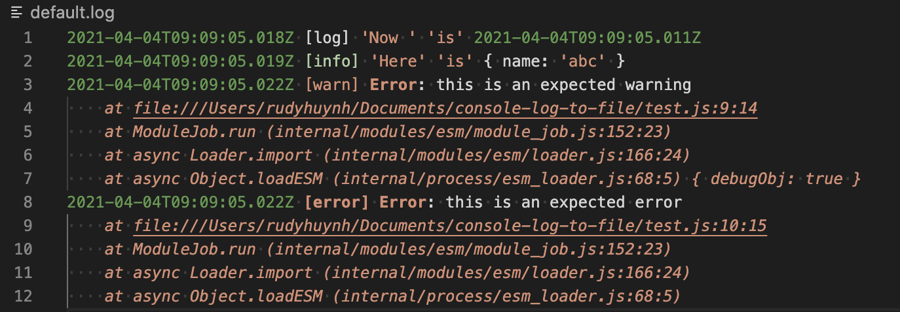

# Save console.log/warn/error/info to file for NodeJS

## Installation

```
npm install console-log-to-file
```

## Usage

Add this to very begining of your app:

```js
import { consoleLogToFile } from "console-log-to-file";
// or `const { consoleLogToFile } = require("console-log-to-file/dist/index.cjs.js")`

consoleLogToFile({
  logFilePath: "/log/default.log",
});

// below will both log to console and to file:
console.log("Now ", "is", new Date());
console.info("Here", "is", { name: "abc" });
console.warn(new Error("this is an expected warning"), { debugObj: true });
console.error(new Error("this is an expected error"));
```

Output to file by default (you can format it by define `options.formatter`):



## API

- `consoleLogToFile(options)`, where `options` accepts:
  - `logFilePath` (string): file path to save log content
  - `formatter` (function(level, args) => string): level is one of `log/warn/error/info`, `args` is log content. See [default formatter](https://github.com/rudyhuynh/console-log-to-file/blob/main/index.js#L4).
  - `includes` (array of `log`, `warn`, `error`, `info`): if defined, will only save to file for included console methods. See [example here](https://github.com/rudyhuynh/console-log-to-file/blob/main/test/test-includes.js#L5).
  - `flags` passed to `fs.createWriteStream`
